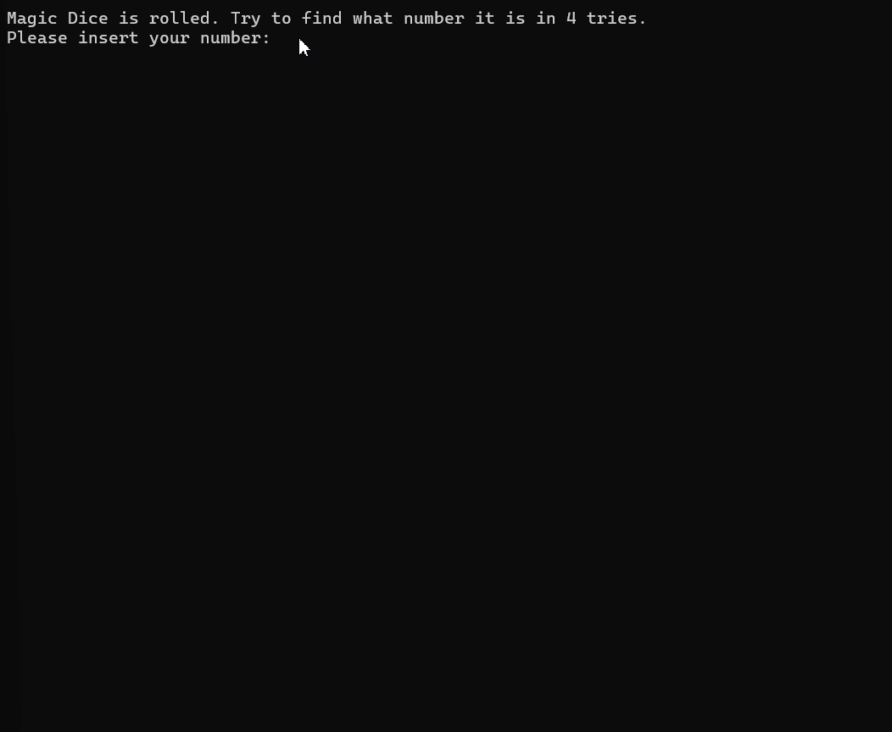

## Demo

A small console guessing game written in C#. The player has 4 attempts to find a random number from 1 to 12 generated by a 'magic' dice.

Description: 

The project implements a simple console game where:

• The Random class is used to generate random numbers.

• There is a Dice class that returns the result of a roll.

• There is a SquidGame class that manages user interaction and the logic of attempts.

Features: 

• Simple command-line interface.

• Valid input check (only integer values 1–12).

• Fixed number of attempts: 4.

• Remaining attempts are displayed for incorrect guesses.

• Display of the correct number if the game is lost.

Requirements:

• .NET SDK (recommended version: .NET 6 or later)

• Text editor / IDE (e.g., Visual Studio, Visual Studio Code)

Instructions for Use:

• Run the program.

• A message will appear saying "Magic Dice is rolled".

• Type an integer from 1 to 12 and press Enter.

• If the guess is correct, you win. You have 4 attempts in total.

• If you enter a non-numeric value or a number out of range, you will be prompted again without losing an attempt.

Code Structure:

• Program.cs: Entry point, creates Random, Dice, and SquidGame objects and calls StartGame.

• Dice: Responsible for generating a random number with the DiceRoll() method.

• SquidGame: Responsible for the game logic, communicating with the user, and checking attempts.
